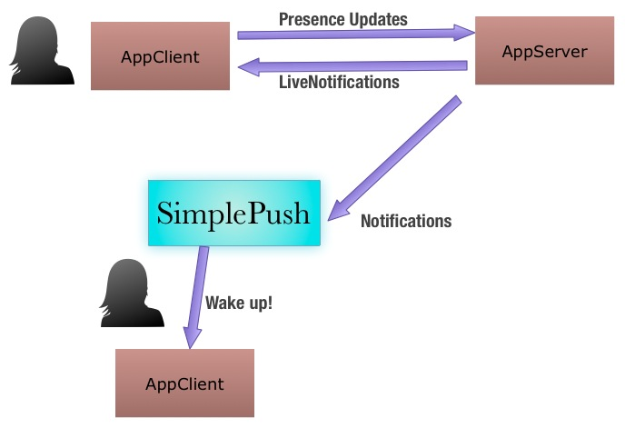
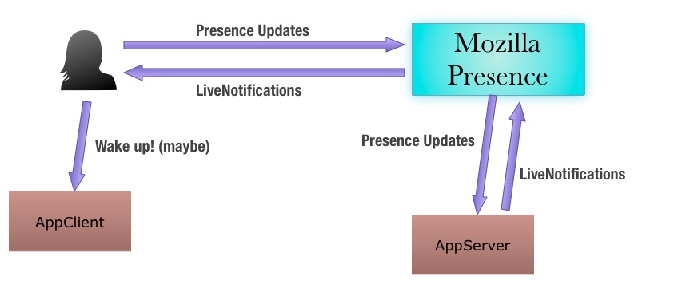

Mozilla Presence
================

----

Problem
-------

Given a social app with a central server ("server")
and a client ("client") running on a Firefox OS device:

* What happens when the client is not running ?
* How can the server know if the user is active on their device ?
  (=presence)
* How can the server notifies the user that someone wants their
  immediate attention in the app ? (=live notification)

----

Current Solution
----------------

* If the client is running
 * Keep a connection open between the server and the client
 * Send presence udpates to the server
 * Receive live notifications from the server
* If the client is not running
 * Wake up the client through SimplePush
 * Start over a connection

----

Current Solution
----------------

----

Current solution issues
-----------------------

* **Resources draining** one connection per app per device
* **Unreliability** the connection is lost when the client is shut down
  by the system. a.k.a.: the *background grey zone*.
* **App-centric** each app has to deal with the problem
* **App-centric** The user cannot control their presence in a single place.

----

Better solution
---------------

Mozilla Presence is a central service with two features:

* keeps track of users' presence (online/offline)
* relay live notifications between the server and the client

----

Better Solution
---------------

----

Why is it better ?
------------------

* **Optimized Resources** the device keeps a single connection
  for status updates and instant notifications.
* **User-centric** the user can decide which apps see their status
  updates.
* **Simplified Integration** the app gets updates from the service
  and send notifications through it. No need to deal with
  the background grey zone or persistent connections.

----

How it works
------------

----

